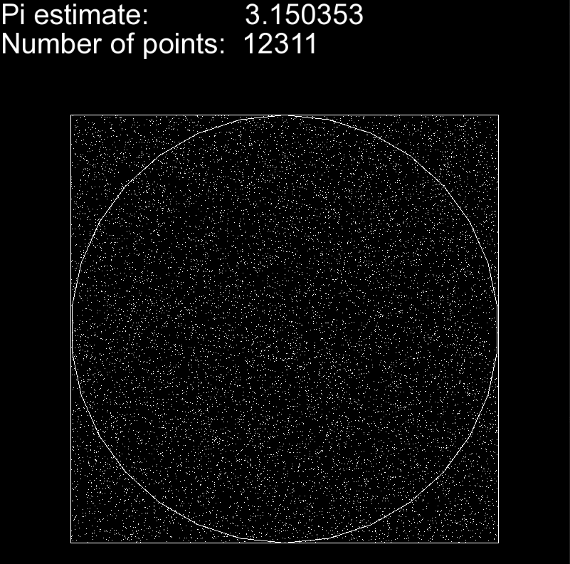
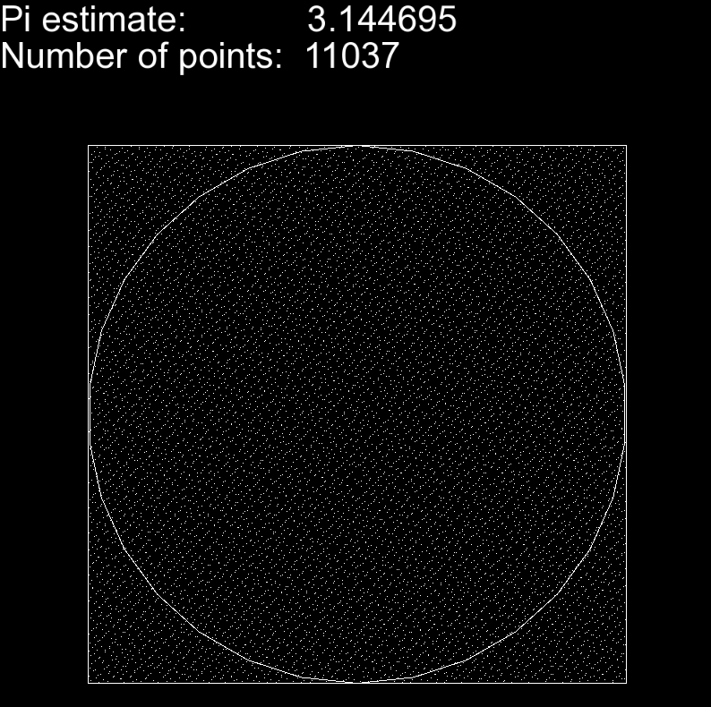
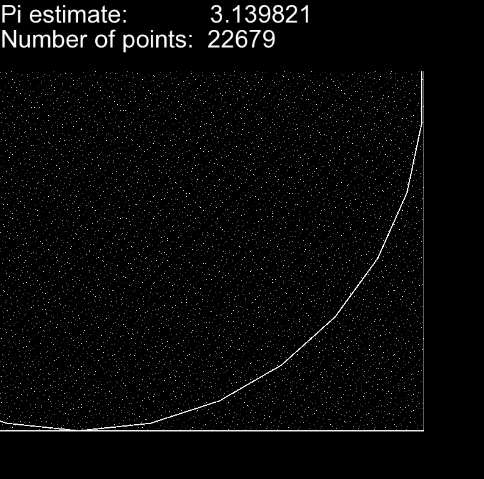

# MonteCarloPi

MonteCarlo simulation can be used to estimate the value of Pi by generating x and y points in a 2-D space. A circle of radius r is included inside a square of side r*2, with the circle centered in the middle of the square. 

Points are randomly generated within the square.
By using the ratio of points generated inside the circle 
and total points generated, an approximation of Pi is obtained.
As more points are generated, the accuracy of the estimation 
will slowly improve. 

To check if the points generated are within the circle,
the following evaluation is made:

    x² + y² <= radius²

To estimate pi, the following formula is used:
    
    4 * num_points_in_circle / num_points_in_total

    
    

A selection of different random number generators is available such as a true random number generator, 
Mersenne Twister and the Sobol generator.
## Visualization
The open source library SFML is used to generate the window and visualize the simulation.
### Moving the camera
The camera can be moved in two ways: zooming in using the scroll wheel and 
translation using the arrow keys.

    

## Building
This project was developed for Linux.
The project can be compiled with the following:

    mkdir build
    cd build
    cmake  -DCMAKE_BUILD_TYPE=Release ..
    make

Boost is required for the Sobol generator. To install using the apt package manager:

    sudo apt-get install libboost-all-dev

For the SFML dependency:
    
    sudo apt-get install libsfml-dev

## Execution

Compiling this project will generate a binary called MonteCarloPi.
Simulation parameters can be specified as command line arguments.
Arguments of interest include some of the following:

- **--help**: view available arguments.
- **--sobol**: use Sobol rng.
- **--random**: use the true random number generator std::random_device.
- **--mersenne_twister**: use std::mt19937 for generating points.
- **--seed**: specify initial seed for pseudo random generators.
